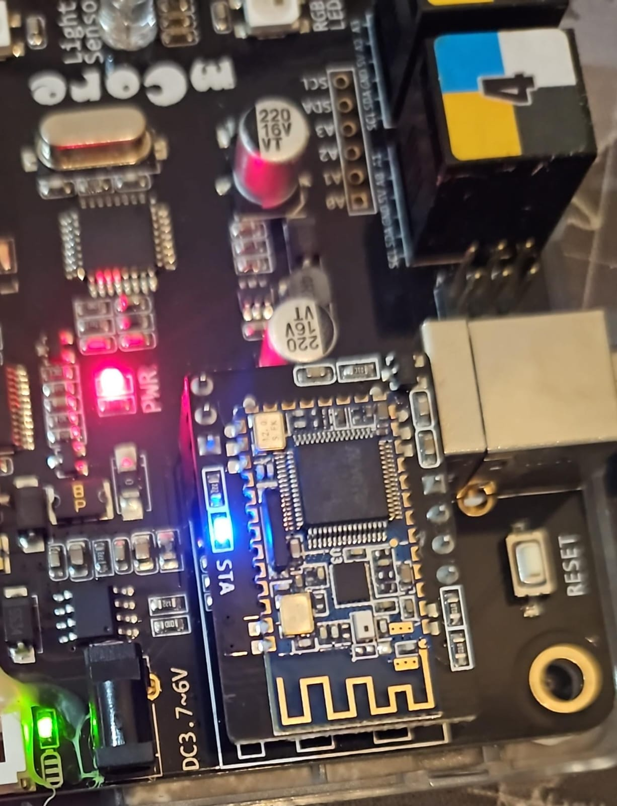
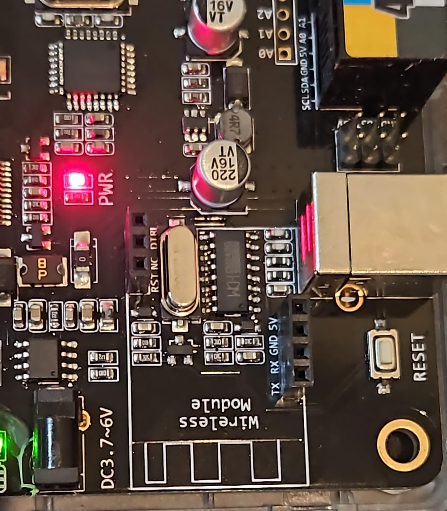
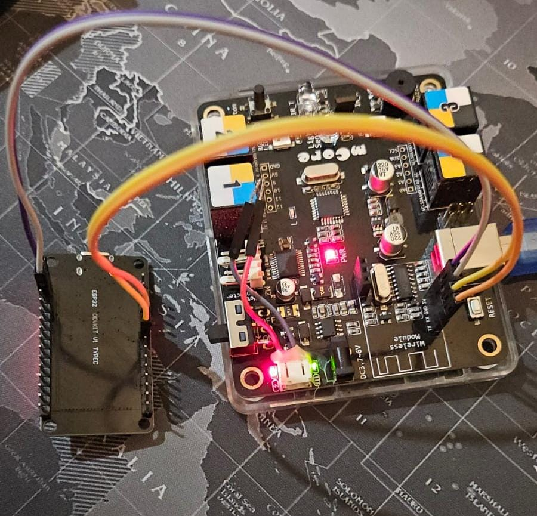
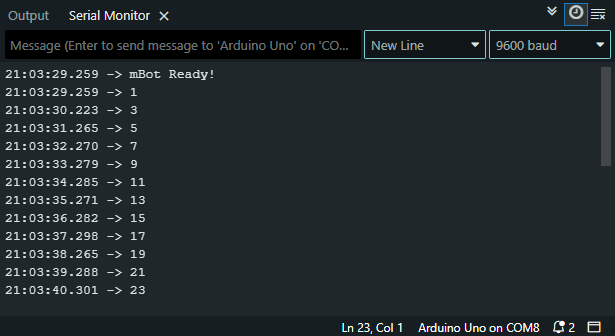

# mBot – ESP32 UART Communication

## Overview

This document describes how to establish and test UART communication between a **Makeblock mBot (mCore board)** and an **ESP32** by replacing the Bluetooth module connection with a direct UART link. The goal is to confirm bidirectional communication using a simple **ping-pong counter**.

<!-- Bluetooth module removed, UART interface exposed -->
<div align="center">
  
  <br/>
  <span style="font-size:2em;">⬇️</span>
  <br/>
  
</div>

**Figure:** The Bluetooth module is removed (top), exposing the UART interface (bottom) for direct ESP32 connection.

## Hardware Setup

### Components

- mBot (mCore board, ATmega328P – Arduino Uno compatible)
- ESP32 development board
- Jumper wires
- Common ground connection

### Wiring

| ESP32 Pin   | mBot Pin (Bluetooth header) | Description        |
| ----------- | --------------------------- | ------------------ |
| TX (GPIO17) | RX of mBot UART             | ESP32 → mBot data  |
| RX (GPIO16) | TX of mBot UART             | mBot → ESP32 data  |
| GND         | GND                         | Common ground      |
| Vin         | 5v                          | mBot → ESP32 power |



⚠️ Ensure both boards share the same ground.  
⚠️ The mBot uses 5V logic (ATmega328P), while ESP32 is 3.3V. Usually the mBot UART accepts 3.3V signals, but if not, use a **logic level shifter**.

---

## Software Setup

### Arduino IDE Board Selection

- **mBot (mCore)** → Select `Arduino Uno`
- **ESP32** → Select `ESP32 Dev Module`

---

## Test Code

### mBot Code (Arduino Uno compatible)

```cpp
// mBot Ping-Pong Test
int counter = 1;

void setup() {
  Serial.begin(9600);
  while (!Serial);
  Serial.println("mBot Ready!");

  // Start with ping 1
  Serial.println(counter);
}

void loop() {
  if (Serial.available()) {
    int value = Serial.parseInt(); // read number from ESP32
    if (value > 0) {
      counter = value + 1;  // increment counter
      delay(500);           // small delay
      Serial.println(counter);
    }
  }
}
```

---

### ESP32 Code

```cpp
#include <Arduino.h>

#define RX_PIN 16   // ESP32 RX connected to mBot TX
#define TX_PIN 17   // ESP32 TX connected to mBot RX

HardwareSerial MBotSerial(1);

void setup() {
  Serial.begin(115200);
  MBotSerial.begin(9600, SERIAL_8N1, RX_PIN, TX_PIN);

  Serial.println("ESP32 Ready!");
}

void loop() {
  if (MBotSerial.available()) {
    int value = MBotSerial.parseInt(); // read number from mBot
    if (value > 0) {
      Serial.print("Got from mBot: ");
      Serial.println(value);

      int nextValue = value + 1;
      delay(500); // avoid flooding
      MBotSerial.println(nextValue);

      Serial.print("Sent to mBot: ");
      Serial.println(nextValue);
    }
  }
}
```

> Serial Output
> 

---

## Expected Output

- The mBot starts by sending `1`.
- ESP32 receives it, prints it, then sends `2`.
- mBot gets `2`, sends `3`.
- ESP32 gets `3`, sends `4`.
- This continues indefinitely.

On the ESP32 Serial Monitor (115200 baud), the output should look like:

```
ESP32 Ready!
Got from mBot: 1
Sent to mBot: 2
Got from mBot: 3
Sent to mBot: 4
Got from mBot: 5
Sent to mBot: 6
...
```

---

## Notes

- Both boards must use the same **baud rate (9600)**.
- Always connect **common ground** between the boards.
- Use a **logic level shifter** if voltage incompatibility causes unreliable communication.
